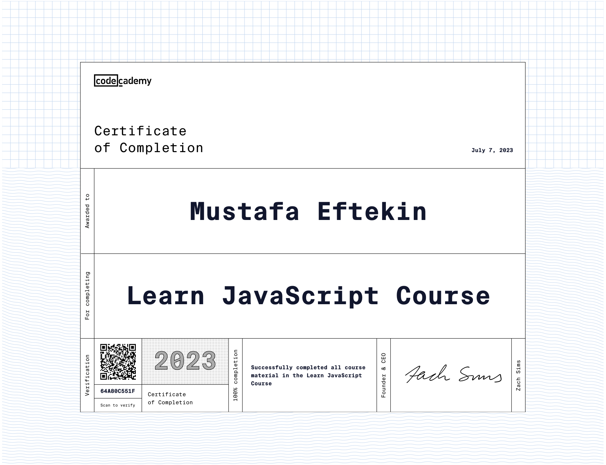

<h1>JavaScript-Practice</h1>

This repository is created for practicing JavaScript as I begin my learning journey. It contains simple code snippets and basic projects that I have worked on while exploring JavaScript concepts.

<h2>Introduction</h2>

As I progressed through my JavaScript learning journey on Codecademy, I found it helpful to have a dedicated repository to store and organize my practice code. This repository serves as a portfolio of my JavaScript skills and showcases the different concepts and techniques I have learned.

<h2>Getting Started</h2>

To get started with the code examples and projects in this repository, you'll need a basic understanding of JavaScript and a development environment set up on your machine. You can follow these steps to get started:

<ol>
  <li><strong>Clone the repository:</strong> Start by cloning this repository to your local machine using the following command: 
    <code>git clone https://github.com/eftekin/JavaScript-Practice.git</code></li>
  <li><strong>Navigate to the repository:</strong> Move into the cloned repository directory: 
    <code>cd JavaScript-Practice</code></li>
  <li><strong>Explore the code:</strong> You can now explore the code examples and projects available in the repository. Each code example or project is stored in its own directory, containing the necessary files and instructions.</li>
</ol>

Feel free to browse through the code examples and explore the various JavaScript concepts in action.

<h2>My Progress</h2>

I have completed the JavaScript course on Codecademy and made significant progress in my learning journey. Here are some of the key topics I have covered:

<ul>
  <li>Variables and Data Types</li>
  <li>Conditional Statements</li>
  <li>Functions</li>
  <li>Scope</li>
  <li>Arrays</li>
  <li>Loops</li>
  <li>Iterators</li>
  <li>Objects</li>
</ul>

With the knowledge gained from the course, I have been able to work on more advanced projects and dive deeper into JavaScript concepts. I'm excited to continue building my skills and exploring new areas of JavaScript development.

If you have any suggestions or ideas for further learning resources or projects, feel free to reach out. I'm always eager to expand my knowledge and improve my coding skills.

<h2>Contributing</h2>

I welcome contributions from the community to enhance this repository and make it more valuable for others. If you'd like to contribute, please follow these steps:

<ol>
  <li>Fork the repository.</li>
  <li>Create a new branch for your feature or bug fix.</li>
  <li>Make your changes and commit them.</li>
  <li>Push your changes to your forked repository.</li>
  <li>Submit a pull request to the main repository.</li>
</ol>

I will review the pull request and work with you to merge the changes if they align with the goals of this repository.

